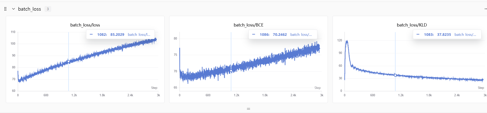

# VAE-MNIST 变分自编码器项目

这是一个使用 **PyTorch** 实现的变分自编码器（Variational Autoencoder, VAE）模型，用于学习 $\text{MNIST}$ 手写数字数据集的潜在表示，并实现高质量的图像生成和重构。

实验过程通过 **SwanLab** 进行了详细跟踪和可视化。

-----

## 🚀 项目介绍 (Introduction)

本项目旨在演示 VAE 的核心原理及其在图像生成中的应用。

  * **数据集：** $\text{MNIST}$ 手写数字数据集。
  * **模型：** 包含一个编码器（Encoder）**将输入图像映射到潜在空间 ($\mu$ 和 $\log\sigma^2$)，以及一个**解码器（Decoder）从潜在向量 $z$ 重构图像。
  * **核心功能：**
      * **图像重构：** 将输入图像编码后再解码，评估重构质量。
      * **图像生成：** 从潜在空间（Latent Space）中采样随机向量 $z$，生成新的、未在训练集中出现过的数字图像。
  * **实验跟踪：** 使用 **SwanLab** 记录训练过程中的 $\text{Batch}$ 损失、$\text{Epoch}$ 平均损失（BCE 和 KLD），便于监控和比较实验结果。

-----

## 🛠️ 环境配置 (Setup)

### 依赖环境

本项目基于 $\text{Python}$ 和 $\text{PyTorch}$ 框架。请确保您的环境中已安装以下库：

```bash
# PyTorch 及其配套库
pip install torch torchvision
# 实验跟踪工具
pip install swanlab
# 数据处理和可视化
pip install numpy matplotlib
```

### 硬件环境

代码设置了 $\text{GPU}$ 优先。根据您的 Colab 运行日志，我们推荐使用 $\text{NVIDIA}$ $\text{GPU}$：

  * **设备：** $\text{NVIDIA}$ $\text{Tesla}$ $\text{T4}$ 或更高性能 $\text{GPU}$。
  * **操作系统：** $\text{Linux}$ (Colab/Jupyter环境)。

-----

## 📐 模型结构 (Model Architecture)

本项目采用全连接（$\text{FC}$）层的 VAE 结构。

### 核心参数

| 参数名 | 值 | 描述 |
| :--- | :--- | :--- |
| `input_dim` | $1 \times 28 \times 28 = 784$ | $\text{MNIST}$ 图像展平后的维度。 |
| `hidden_dim` | $256$ | 编码器和解码器中间层的维度。 |
| `Latent_dim` | $20$ | 潜在空间（Latent Space）的维度 $Z$。 |
| `learning_rate` | $1e-3$ | $\text{AdamW}$ 优化器的学习率。 |
| `epochs` | $50$ (代码中设置为 $\text{50}$ $\text{Epochs}$) | 总训练轮次。 |

### VAE 类定义 (`VAE(nn.Module)`)

**1. 编码器 (`Encoder`)**

  * 输入：$x$ (图像) $\rightarrow$ 展平 ($784$)
  * 隐藏层：$\text{Linear}(\text{784}, \text{256}) \rightarrow \text{ReLU}$
  * 输出：
      * **均值 ($\mu$)：** $\text{Linear}(\text{256}, \text{20})$
      * **对数方差 ($\log\sigma^2$)：** $\text{Linear}(\text{256}, \text{20})$

**2. 重参数化技巧 (`reparametersize`)**

用于从潜在分布 $q(z|x)$ 中采样 $z$。
$$z = \mu + \epsilon \odot \exp(0.5 \cdot \log\sigma^2), \quad \epsilon \sim N(0, I)$$

**3. 解码器 (`Decoder`)**

  * 输入：$z$ (潜在向量) ($\text{20}$)
  * 隐藏层：$\text{Linear}(\text{20}, \text{256}) \rightarrow \text{ReLU}$
  * 输出：$\text{Linear}(\text{256}, \text{784}) \rightarrow \text{Sigmoid} \rightarrow$ 重新调整形状到 $(1, 28, 28)$。

-----

## 📉 损失函数 (Loss Function)

VAE 的损失函数（$\text{ELBO}$ 的负值）由两部分组成：**重构损失**和$\text{KL}$ 散度损失。

$$\mathcal{L}_{VAE} = \text{BCE}(x, \hat{x}) + \beta \cdot \text{KLD}(q(z|x) \| p(z))$$

### 1\. 重构损失 (BCE)

使用**二元交叉熵** ($\text{BCE}$) 衡量重构图像 $\hat{x}$ 与原图 $x$ 的相似度。

```python
BCE = torch.sum(F.binary_cross_entropy(recon_batch, batch_imgs, reduction='none'), dim=(1, 2, 3))
```

### 2\. KL 散度损失 (KLD)

衡量编码器输出的潜在分布 $q(z|x)$ 与标准正态先验 $p(z)$ 之间的距离，用于正则化潜在空间。

```python
KLD = -0.5 * torch.sum(1 + logvar - mu.pow(2) - logvar.exp(), dim=-1)
```

### 3\. KL 退火 (KL Annealing)

本项目采用了**线性退火**策略来逐渐增加 $\text{KLD}$ 损失的权重 $\beta$ (`kl_weight`)，以确保模型在训练初期专注于图像重构。

```python
kl_weight = i / num_epochs 
loss = torch.mean(BCE + kl_weight * KLD)
```

-----

## 🏃 运行和结果

### 训练流程

运行 Colab 笔记本中的所有单元格即可开始训练。训练过程中的日志将输出每 $\text{Epoch}$ 的**平均损失**：

```
--- Epoch [X/50] Summary ---
Avg Loss: 103.5454, Avg BCE: 77.1958, Avg KLD: 26.8873
Model saved at epoch X.
```

### 结果可视化



#### 1\. 图像重构 (Reconstruction)

随机选取一张 $\text{MNIST}$ 图像，通过 VAE 模型进行编码和解码，展示**原图**和**重构图**的对比。

#### 2\. 图像生成 (Generation)

从潜在空间 $Z$ 中采样一个**随机噪声向量** (`torch.randn(1, 20)`)，通过解码器生成一张新的图像，展示模型的生成能力。

# Reference
1. https://www.bilibili.com/video/BV1ix4y1x7MR/?spm_id_from=333.337.search-card.all.click&vd_source=9684ecbd9b040058fc28261bb226b1de

2. https://www.bilibili.com/video/BV1wx421k74m/?spm_id_from=333.337.search-card.all.click&vd_source=9684ecbd9b040058fc28261bb226b1de

3. https://www.bilibili.com/video/BV1cz7Dz6EHs/?spm_id_from=333.1391.0.0&vd_source=9684ecbd9b040058fc28261bb226b1de

4. https://www.bilibili.com/video/BV1op421S7Ep/?spm_id_from=333.337.search-card.all.click&vd_source=9684ecbd9b040058fc28261bb226b1de

5. https://github.com/owenliang/torch-vae/blob/main/vae.ipynb

